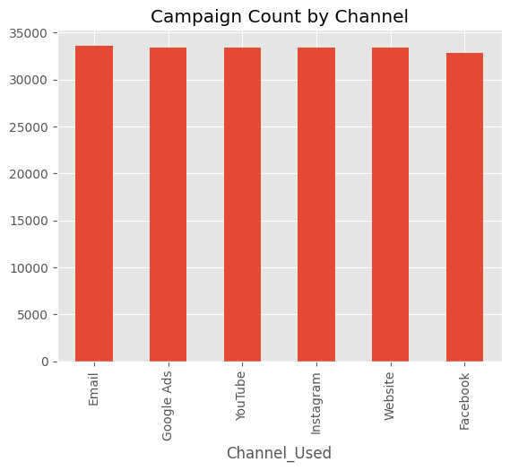
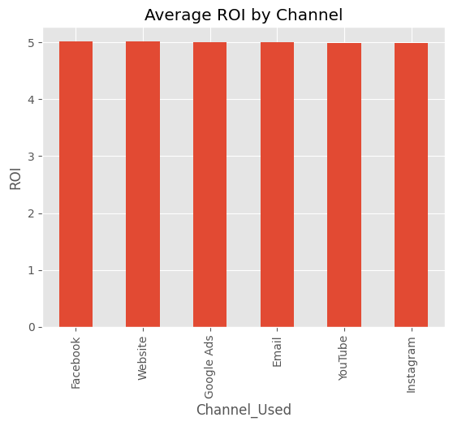
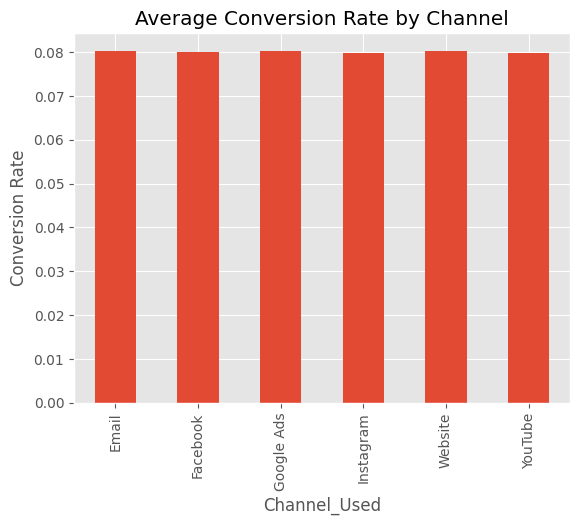
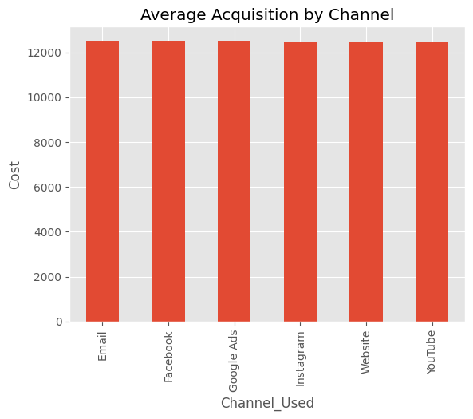
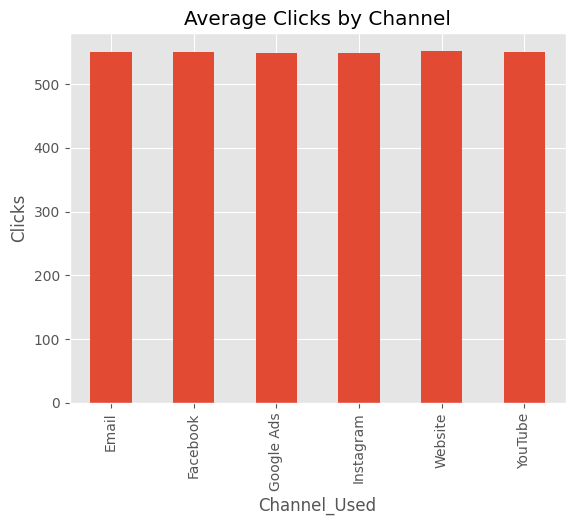
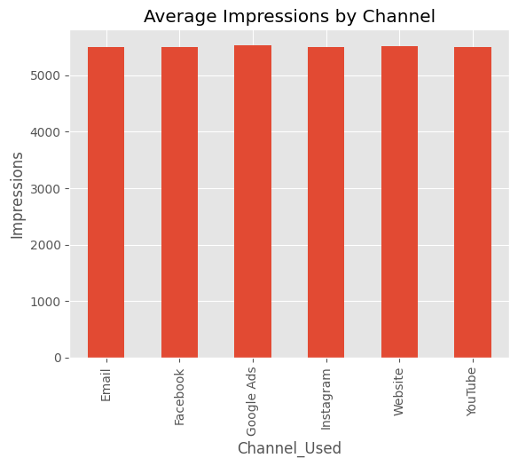
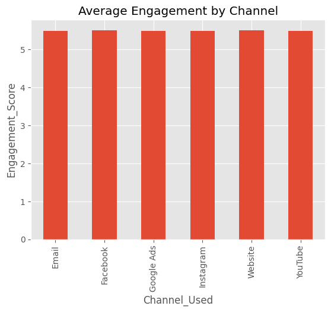
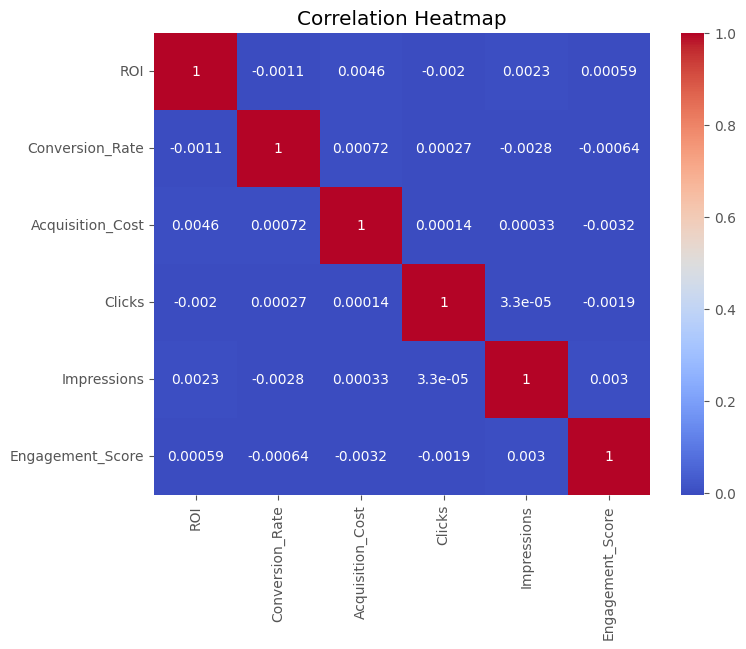
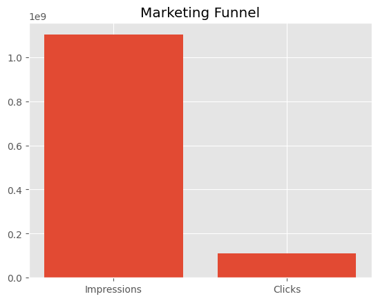

# SCT_DA_4

# Business Insights Report (EDA)

## Project Overview

This project focuses on performing Exploratory Data Analysis (EDA) on a Marketing Campaign Dataset. The aim is to understand campaign performance, customer engagement, and Return on Investment (ROI) to derive actionable business insights.

---

## Objective

- Perform data cleaning and preprocessing.
- Explore marketing campaign data using visualizations.
- Analyze campaign performance across different channels.
- Study ROI, conversion rates, impressions, clicks, and engagement.
- Understand relationships between variables through correlation analysis.
- Generate business insights and recommendations.

---

## Dataset Features

The dataset contains the following attributes:

- Campaign_ID
- Company
- Campaign_Type
- Target_Audience
- Duration
- Channel_Used
- Conversion_Rate
- Acquisition_Cost
- ROI
- Location
- Language
- Clicks
- Impressions
- Engagement_Score
- Customer_Segment
- Date

---

## Libraries Used

- Pandas
- Matplotlib
- Seaborn

---

## Data Cleaning and Preprocessing

The following steps were performed:

- Loaded the marketing campaign dataset.
- Inspected columns and data types.
- Converted the Date column into datetime format.
- Checked missing values.
- Removed duplicate rows.
- Generated statistical summaries.
- Exported the cleaned dataset.

---

# Exploratory Data Analysis

## Channel Distribution

Analyzed the distribution of campaigns across different channels.

---

## Average ROI by Channel

Compared average Return on Investment across channels.

---

## Conversion Rate by Channel

Studied how conversion rates vary across channels.

---

## Acquisition Cost by Channel

Compared customer acquisition costs among channels.

---

## Clicks by Channel

Analyzed customer interactions based on clicks.

---

## Impressions by Channel

Examined campaign reach using impressions.

---

## Engagement Score Distribution

Visualized customer engagement levels.

---

## Correlation Heatmap

Analyzed relationships among numerical variables.

---

## Marketing Funnel Analysis

Compared impressions and clicks to understand the marketing funnel.

---

# Key Insights

- Marketing campaigns are distributed almost equally across channels.
- ROI differs across channels, indicating varying effectiveness.
- Higher conversion rates contribute positively to ROI.
- Impressions are significantly larger than clicks, reflecting a typical marketing funnel.
- Customer engagement varies among campaigns.
- Correlation analysis helps identify relationships among campaign metrics.

---

# Recommendations

- Allocate higher budgets to channels with better ROI.
- Improve campaigns with lower conversion rates.
- Focus on increasing customer engagement.
- Continuously monitor campaign performance metrics.
- Make data-driven decisions to maximize marketing efficiency.

---

# Conclusion

This project successfully performed Exploratory Data Analysis on a marketing campaign dataset. The analysis provided insights into campaign effectiveness, ROI, conversion rates, customer engagement, and overall marketing performance. These findings can help organizations optimize their marketing strategies and improve business outcomes.

---
